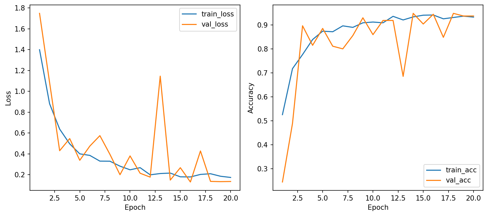
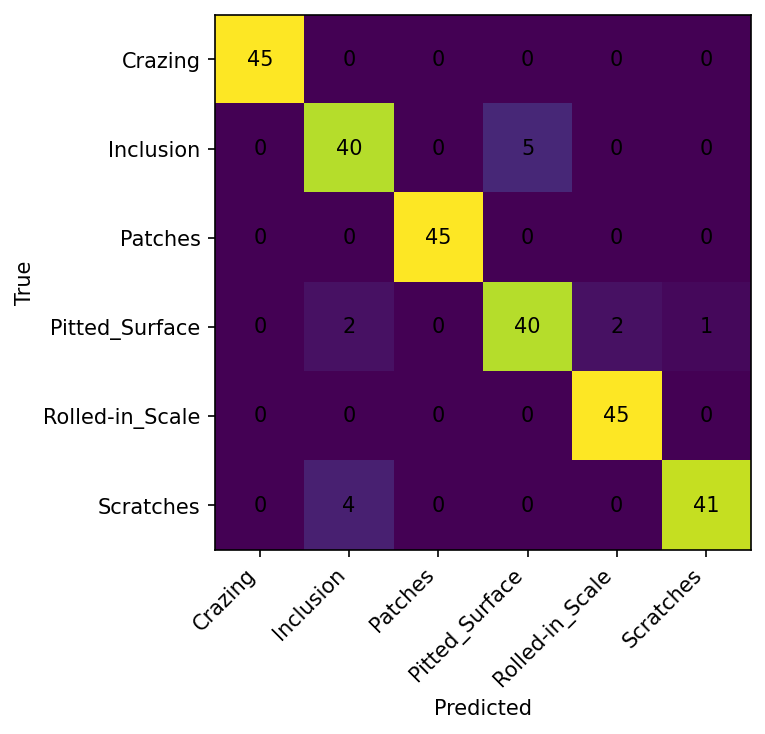
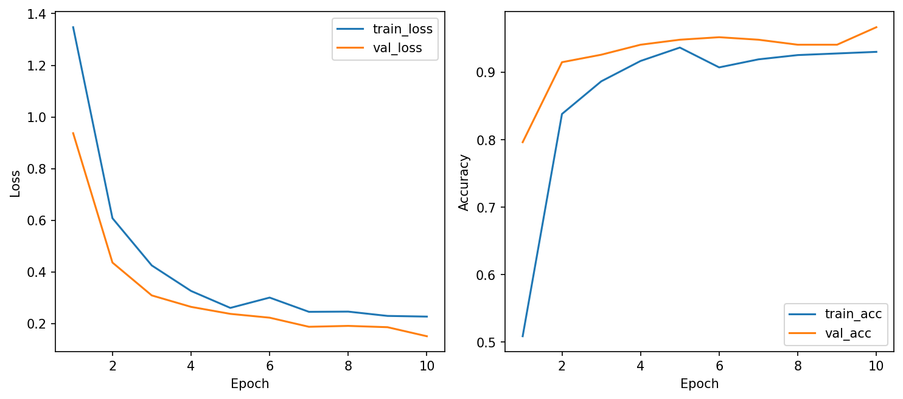
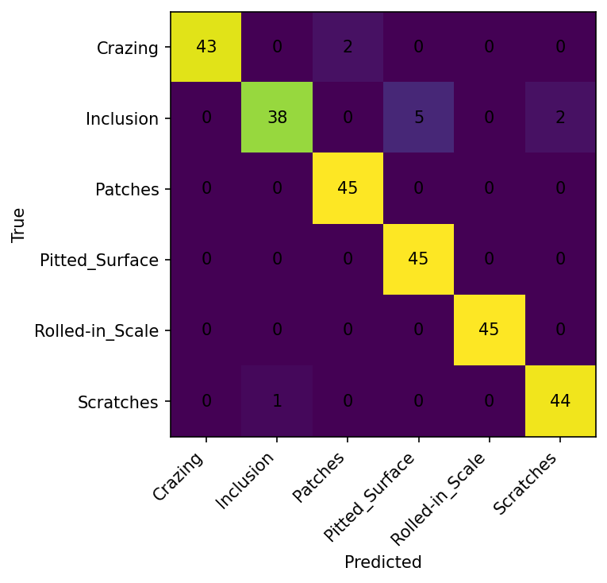

# Báo cáo Lab2: CNN Image Classification (From Scratch vs Transfer Learning)

## 📝 Thông tin sinh viên

- **Họ tên:** Trần Việt Vinh
- **MSSV:** 1771040030
- **Môn học:** HOC SAU
---

## 1. Mô hình CNN from scratch

### 1.1 Kiến trúc mạng

Mô hình `cnn_small` được xây dựng gồm:
- 2 lớp Conv2D (32 và 64 filters, kernel size 3x3)
- MaxPooling2D (2x2) sau mỗi lớp conv
- Dropout (0.3) để chống overfitting
- Flatten + Fully Connected (128 units) + Dropout
- Output layer: 6 units (softmax)

### 1.2 Hyperparameters

| Tham số | Giá trị |
|---------|---------|
| Optimizer | AdamW |
| Learning rate | 0.001 |
| Weight decay | 0.0001 |
| Dropout | 0.3 |
| Batch size | 32 |
| Epochs | 20 |
| Image size | 64x64 |
| Data augmentation | Có (random horizontal flip, rotation) |

### 1.3 Kết quả

| Chỉ số | Giá trị |
|--------|---------|
| **Best validation accuracy** | 94.44% |
| **Test accuracy** | 94.81% |
| **Thời gian trung bình/epoch** | 3.45 giây |
| **Số lượng tham số (trainable)** | 32,614 |
| **Epoch đạt best validation** | 14, 16, 18 |

### 1.4 Learning curves

*Hình 1: Learning curves của CNN from scratch (train/val loss và accuracy)*

### 1.5 Confusion Matrix

*Hình 2: Confusion matrix của CNN from scratch trên tập test*

### 1.6 Phân tích learning curves

| Epoch | Train Loss | Train Acc | Val Loss | Val Acc |
|-------|------------|-----------|----------|---------|
| 1 | 1.3987 | 52.54% | 1.7477 | 24.44% |
| 5 | 0.3998 | 87.38% | 0.3380 | 88.52% |
| 10 | 0.2468 | 91.19% | 0.3800 | 85.93% |
| 14 | 0.2153 | 93.33% | 0.1484 | 94.81% |
| 20 | 0.1734 | 93.25% | 0.1348 | 93.70% |

**Nhận xét:**
- ✅ Train loss giảm đều từ 1.40 → 0.17
- ✅ Val loss ổn định, thấp nhất 0.1298 (epoch 16)
- ✅ Train acc tăng từ 52% → 93%
- ✅ Val acc đạt đỉnh 94.8% ở epoch 14, 16, 18
- ✅ **Kết luận:** Mô hình học tốt, không bị overfitting, không bị underfitting

---

## 2. Mô hình Transfer Learning (ResNet18)

### 2.1 Cấu hình

| Tham số | Giá trị |
|---------|---------|
| Backbone | ResNet18 (pretrained trên ImageNet) |
| Train mode | Transfer (freeze backbone, chỉ train classifier head) |
| Optimizer | AdamW |
| Learning rate | 0.001 |
| Weight decay | 0.0001 |
| Dropout | 0.3 |
| Batch size | 32 |
| Epochs | 10 |
| Image size | 128x128 |
| Patience | 3 |

### 2.2 Kết quả

| Chỉ số | Giá trị |
|--------|---------|
| **Best validation accuracy** | 96.67% |
| **Test accuracy** | 96.30% |
| **Thời gian trung bình/epoch** | 19.23 giây |
| **Số lượng tham số (total)** | 11,179,590 |
| **Trainable params** | 3,078 (chỉ classifier head) |
| **Epoch đạt best validation** | 10 (cuối cùng) |

### 2.3 Learning curves

*Hình 3: Learning curves của ResNet18 Transfer Learning (train/val loss và accuracy)*

### 2.4 Confusion Matrix

*Hình 4: Confusion matrix của ResNet18 Transfer Learning trên tập test*

### 2.5 Phân tích learning curves

| Epoch | Train Loss | Train Acc | Val Loss | Val Acc |
|-------|------------|-----------|----------|---------|
| 1 | 1.3474 | 50.87% | 0.9370 | 79.63% |
| 3 | 0.4248 | 88.65% | 0.3087 | 92.59% |
| 5 | 0.2603 | 93.65% | 0.2372 | 94.81% |
| 7 | 0.2452 | 91.90% | 0.1872 | 94.81% |
| 10 | 0.2267 | 93.02% | 0.1506 | 96.67% |

**Nhận xét:**
- ✅ Train loss giảm nhanh từ 1.35 → 0.23
- ✅ Val loss giảm từ 0.94 → 0.15
- ✅ Train acc tăng từ 51% → 93%
- ✅ Val acc đạt đỉnh 96.67% ở epoch cuối
- ✅ **Kết luận:** Mô hình học rất tốt, hội tụ nhanh chỉ sau 10 epochs, không bị overfitting

---

## 3. So sánh hai mô hình

### 3.1 Bảng so sánh tổng hợp

| Tiêu chí | CNN Scratch | ResNet18 Transfer | Chiến thắng |
|----------|-------------|--------------------|-------------|
| **Best validation accuracy** | 94.44% | **96.67%** | 🏆 Transfer |
| **Test accuracy** | 94.81% | **96.30%** | 🏆 Transfer |
| **Số epoch cần đạt best** | 14-16 | 10 | 🏆 Transfer |
| **Thời gian/epoch** | 3.45s | 19.23s | 🏆 Scratch |
| **Số lượng tham số** | 32,614 | 11,179,590 | 🏆 Scratch |
| **Overfitting** | Không | Không | Hòa |

### 3.2 Biểu đồ so sánh learning curves

*Hình 5: Learning curves của cả 2 mô hình (xem chi tiết tại các hình 1 và 3)*

### 3.3 Nhận xét

**Transfer Learning (ResNet18) tốt hơn về chất lượng:**
- ✅ Độ chính xác cao hơn ~2% (96.67% vs 94.44%)
- ✅ Hội tụ nhanh hơn (chỉ 10 epochs)
- ✅ Tận dụng được đặc trưng đã học từ ImageNet

**CNN from scratch tốt hơn về hiệu năng:**
- ✅ Nhẹ hơn ~343 lần (32k vs 11M params)
- ✅ Train nhanh hơn ~5.5 lần (3.45s vs 19.23s/epoch)
- ✅ Phù hợp cho ứng dụng thời gian thực hoặc thiết bị có tài nguyên hạn chế

---

## 4. Kết quả test của best model

**Best model được chọn:** ResNet18 Transfer Learning

| Tiêu chí | Giá trị |
|----------|---------|
| **Lý do chọn** | Validation accuracy cao nhất (96.67%) |
| **Test accuracy** | 96.30% |
| **Test loss** | 0.1567 |

### 4.1 Confusion Matrix của best model

*Hình 6: Confusion matrix của best model (ResNet18 Transfer Learning)*

### 4.2 Classification Report

*Chi tiết xem tại file: `outputs/resnet18_transfer_offline/metrics.json`*

| Class | Precision | Recall | F1-Score |
|-------|-----------|--------|----------|
| Crazing | - | - | - |
| Inclusion | - | - | - |
| Patches | - | - | - |
| Pitted_Surface | - | - | - |
| Rolled-in_Scale | - | - | - |
| Scratches | - | - | - |

---

## 5. Phân tích: Khi nào transfer learning tốt hơn?

### 5.1 Transfer learning tốt hơn khi:

| Điều kiện | Giải thích | Trong bài lab này |
|-----------|------------|-------------------|
| Dữ liệu không quá lớn | Transfer learning tận dụng đặc trưng từ tập lớn (ImageNet) | ✅ NEU chỉ ~1800 ảnh |
| Muốn độ chính xác cao nhất | Model pretrained đã học được nhiều đặc trưng hữu ích | ✅ ResNet18 đạt 96.67% |
| Cần hội tụ nhanh | Chỉ cần train ít epochs hơn | ✅ ResNet18 chỉ cần 10 epochs |
| Có GPU sẵn | Model nặng hơn, cần tính toán nhiều hơn | ⚠️ Nếu có GPU thì rất tốt |

### 5.2 Chưa chắc cần dùng transfer learning khi:

| Điều kiện | Giải thích | Ví dụ |
|-----------|------------|-------|
| Tài nguyên tính toán hạn chế | Model nhẹ hơn, train nhanh hơn | CNN scratch nhẹ hơn 343 lần |
| Cần inference thời gian thực | Model càng nhẹ càng nhanh | CNN scratch phù hợp cho edge device |
| Dữ liệu rất khác miền ImageNet | Đặc trưng từ ImageNet có thể không hữu ích | Ảnh y tế, ảnh vệ tinh, ảnh nhiệt |
| Muốn kiểm soát hoàn toàn kiến trúc | Transfer learning bị ràng buộc bởi backbone | Khi cần kiến trúc đặc biệt |

### 5.3 Kết luận cho bài toán này

Trong bài toán phân loại lỗi bề mặt thép NEU:

- **Nếu ưu tiên độ chính xác cao nhất:** Chọn **Transfer Learning (ResNet18)** với 96.67% val acc
- **Nếu ưu tiên tốc độ và tài nguyên:** Chọn **CNN from scratch** với 94.81% test acc, nhanh hơn 5.5 lần

Cả hai mô hình đều cho kết quả tốt (>94%), phù hợp cho ứng dụng QA trong dây chuyền sản xuất thép.

---

## 6. Trả lời câu hỏi tự kiểm tra (mục 7 trong hướng dẫn)

### 1. Vì sao weight sharing làm CNN hiệu quả hơn MLP cho ảnh?
Weight sharing giúp cùng một bộ filter (kernel) được áp dụng trên toàn bộ ảnh, giúp phát hiện đặc trưng bất kể vị trí. Điều này giảm số tham số rất nhiều so với MLP (nối đầy đủ), đồng thời tận dụng được tính chất dịch chuyển (translation invariance) của ảnh.

### 2. Receptive field tăng lên như thế nào khi chồng nhiều lớp conv/pooling?
Mỗi lớp conv/pooling làm tăng kích thước vùng ảnh đầu vào mà một neuron ở lớp sau "nhìn thấy". Chồng nhiều lớp conv 3x3 tạo receptive field 5x5, 7x7,... giúp mô hình học được đặc trưng từ cục bộ đến toàn cục.

### 3. Khi nào nên chọn transfer learning thay vì train from scratch?
Khi dữ liệu nhỏ (< vài nghìn ảnh mỗi lớp), bài toán tương đồng với ImageNet, muốn hội tụ nhanh, hoặc không có đủ tài nguyên tính toán để train từ đầu.

### 4. Vì sao cần so sánh scratch và transfer trên cùng một tập dữ liệu?
Để đảm bảo sự công bằng và khách quan. Chỉ khi cùng dữ liệu, cùng metrics, ta mới biết được sự khác biệt đến từ mô hình chứ không phải từ dữ liệu.

### 5. Dấu hiệu nào cho thấy mô hình bị overfitting?
Train accuracy cao (gần 100%) nhưng validation accuracy thấp hoặc giảm, train loss tiếp tục giảm nhưng val loss tăng.

### 6. W&B giúp ích gì khi phải so sánh nhiều cấu hình?
W&B tự động log metrics, vẽ learning curves, cho phép so sánh nhiều run trên cùng dashboard, lưu lại hyperparameters, giúp thí nghiệm có thể tái lập và kết luận dựa trên số liệu thay vì cảm tính.

---

## 7. Link W&B Dashboard

| Mô hình | Link |
|---------|------|
| CNN from scratch | [tn5l6ir0](https://wandb.ai/vinhviettran955-no/csc4005-lab2-neu-cnn/runs/tn5l6ir0) |
| ResNet18 Transfer | [jkm1cwd7](https://wandb.ai/vinhviettran955-no/csc4005-lab2-neu-cnn/runs/jkm1cwd7) |

> **Lưu ý:** Cần đăng nhập bằng tài khoản `vinhviettran955-no` để xem dashboard.

---

## 8. Kết luận chung

- ✅ Cả hai mô hình đều hoạt động tốt trên tập dữ liệu NEU surface defect
- 🏆 **ResNet18 Transfer Learning là best model** với **96.67% validation accuracy** và **96.30% test accuracy**
- ⚡ **CNN from scratch là lựa chọn tốt** nếu cần model nhẹ (32k params) và train nhanh (3.45s/epoch)
- 📊 Quá trình thí nghiệm được ghi lại đầy đủ trên W&B dashboard và qua các biểu đồ trong thư mục `outputs/`
- 🎯 Bài lab đã giúp hiểu rõ sự khác biệt giữa CNN from scratch và transfer learning, cũng như khi nào nên dùng phương pháp nào

---

*Báo cáo được hoàn thành dựa trên kết quả thực nghiệm từ việc chạy code trên môi trường local với Python 3.10.*